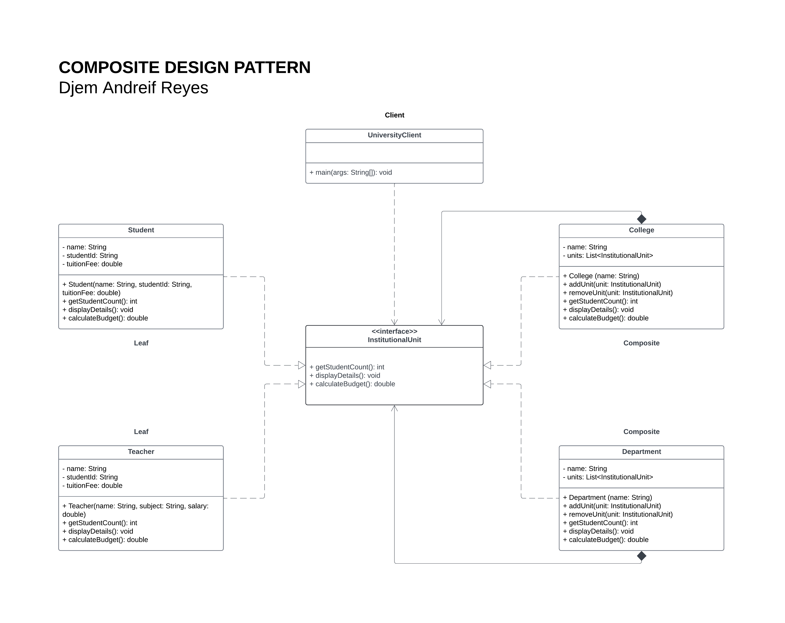

# Laboratory Assignment 8
This is Laboratory Assignment 8 for the course, Software Engineering 2, taken during the Second Semester of Academic Year 2025-2026 at New Era University.

# New Era University - Composite Pattern Implementation

## Problem Statement
New Era University requires a system to represent its various organizational units, which can be individual entities or compositions of other entities. The system must fulfill the following core requirements:
* **Model the hierarchical structure:** Accurately represent the "part-whole" relationships between different entities, such as a College containing a department, or a department containing a teacher.
* **Calculate the number of students:** Compute the total number of students within any given College, including those in its departments and any sub-Colleges.
* **Calculate the budget:** Determine the total budget for a College.
* **Display details:** Show the details of any educational unit (College, department, teacher, or student) in a clear and organized manner.

## Class Description
The system is built using the **Composite Design Pattern**, allowing individual objects and compositions of objects to be treated uniformly across the university hierarchy. 

* **`EducationalUnit` (Interface):** The base Component interface. It defines the standard operations (`getStudentCount()`, `displayDetails()`, `calculateBudget()`) that all concrete entities within the university must implement.
* **`Teacher` (Leaf):** Represents an individual instructor. Its budget calculation returns its salary, and its student count inherently returns zero.
* **`Student` (Leaf):** Represents an enrolled student. Its budget calculation returns the negative value of its tuition fee, and its student count returns one.
* **`Department` (Composite):** A subdivision container that holds a collection of `InstitutionalUnit` objects (such as teachers and students). Its operations iterate through its enrolled children to dynamically sum the student counts and budgets.
* **`College` (Composite):** A high-level organizational container that holds a collection of `InstitutionalUnit` objects (which can be departments, individual students/teachers, or even sub-colleges). It delegates calculations and data displaying directly to its child nodes.
* **`UniversityClient` (Client):** The execution entry point that demonstrates the pattern by creating instances of leaves and composites, assembling them into a tree structure, and executing the required operations on the root node.

## Class Diagram

